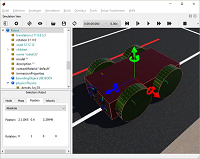

# Autonomous Cabs Group 3
**Group members**:   
Henrik Claßen  
Justus Flerlage  
Felix Heimann  
Luyanda Mlangeni  
Gerda Zsejke Móré  
Yue Wang

## Project overview
A **short** summary of your project topic.

### Goals
What were your main goals?

### Requirements
List the **necessary** and **optional** requirements that were set for your project.

- Requirement 1
- Requirement 2
- Requirement 3

### Approach
How have you tried to meet the above requirements? What were your ideas?

- Approach 1
- Approach 2
- Approach 3

## System architecture
Some **general** information about your ideas to the overall system architecture.

### Software design
**Short** overview of your software design. Maybe a diagram that illustrates the connections between the individual components. 

Please **do not** use the diagram from our project description.


### Robot design
What does your robot look like, and what functionality does it contain. 
But most of all: **Why** did you choose this design?

<!--  -->

### Environment design
What does the environment look like in which your robot operates? 
The same: **Why** did you choose this environment?

<!--  -->

### Algorithms
Write an introduction to the **most essential** algorithms or technologies in general that you have chosen for your project. 

Maybe with **short** code examples.

```python
def our_algorithm(x, y):
    # Do fancy stuff here
    return {'x': x, 'y': y}
```

## Summary
Overview of the achieved **and** not attained goals. Why were some goals not reached? Too difficult or wrong time management?

### Lessions learned
What did you learn from the project? What decisions would you have made differently from your current perspective?

### Future work
What problems would you tackle if you would continue to work on the project? Are there things you might actually take up and work on in the future? This part is **optional**.

