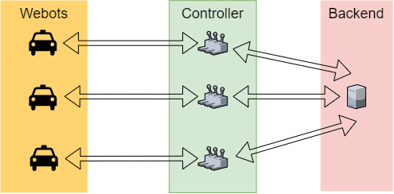
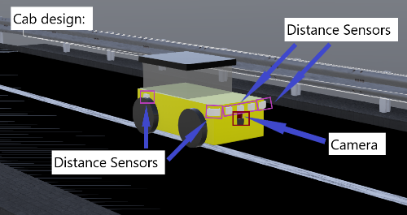

# Cab Service 3
**Group members**: *Henrik Claßen*, *Justus Flerlage*, *Felix Heimann*, *Luyanda Mlangeni*, *Gerda Zsejke Móré*, *Yue Wang*

## Project overview
Cities like Copenhagen in Denmark show how modern transportation will look like.
Here computers control the metro fully automated without any human driving interaction.
We want to take this a step further by creating an autonomous cab-on-demand service for transporting
passengers from their predefined locations to their destinations.

### Goals
Our main goal is to have a working prototype, meeting given requirements. The project is very challenging,
so problems with algorithms are expected. Therefor, related issues are still within our goal set.

### Requirements
#### General
- Pick up passengers at predefined locations
- Transport passengers quickly to their destination
- Use available cabs efficiently
- Avoid collisions
#### Environment
- All roads should be one-way(exception: connection to the depot)
- There should be at least two passing sections
- There should be at least one depot, where you can park unused cabs
- There should be at least four pick-up locations
#### Robot
- Only use the following types of sensors: ultrasonic distance sensor, camera, light sensor
- Place at least two robots in your environment
- Each robot has room for at least two passengers
#### Control
- Use the general architecture from the overview presentation
- Coordinate your robots to achieve your mission
- Make the operation safe: robust to communication failure, ...
- Verify/validate the operation
- Optimize cab efficiency: average travel time, load, ...

### Approach
Creating an autonomous service is related to a lot of problems. Especially, things
like collision avoidance and general path following are very difficult problems, even in more simpler environments.
Nevertheless, we tried to satisfy given requirements by introducing three separated applications. That way
work distribution is easier. In average two weekly meetings were held, in order to distribute tasks for solving
issues.

## System architecture
The overall system architecture consists of three different applications. For each cab there is a single instance
of the webots controller and a single instance of the external controller. Here the webots controller is responsible
for the interaction with our simulated environment, while the external controller manages and controls the cab by using
provided data. It is like the brain of a cab, while the webots controller is more like muscles and senses. The third application
is the backend, which controls passenger requests and the cab provisioning and distribution by communicating with
the external controller. 



### Software design
#### General
The communication between all three componets is done by using the Transmission Control Protocol (TCP), 
as it is reliable and still fast enough for our purposes. For this, we introduced a binary protocol 
on top of TCP for exchanging data between all parties.

#### Webots Controller
A single class is implemented, which handles the data exchange and command execution:
- Written in C++17
- Utilizing the [webots API](https://www.cyberbotics.com/doc/reference/index) for the interaction with the environment
- Asynchronous networking with [Boost](https://www.boost.org/)

#### External Controller
Since the external controller is the most important application, as it controls and manages a cab, it is written in Ada:
- Ada makes it easier to verify program code and to proof its correctness
- Makes use of three different modules each running in its own thread:  
    - Two manage the communication with the backend and the webots controller
    - The third one does calculation

#### Backend
The backend is a simple TCP server:
- Written in C++17
- Uses [Boost](https://www.boost.org/) for asynchronous networking, graph abstraction and command line parsing
- Receives position and route data from the external controllers
- Retrieves any passenger requests and distributes those onto the cabs

### Robot design
The cab hast two sensor types: a camera and several distance sensors
- The camera placed in front is used to detect the white line on the road
- The distance sensors are places at the front and both sides of the cab to detect the road barriers as well as
obstacles on the road.



### Environment design
The environment consists of eight pickup locations and a depot for the unused cabs.
Pickup locations on the outer roads (P4 - P7) take a longer time to arrive at, which
allows for a more complex cab provision algorithm.


### Algorithms
To fulfill our goals we implemented three main algorithms: path following, collision avoidance and cab provision.

#### Path following
The path following algorithm can be broken down into 5 steps:
1. Reading the BGRA image from a webots message and removing the alpha channel
2. Convert the BGR image to a grey scale image
3. From the grey scale image create a black and white image
    - If the grey value of a pixel is above a certain threshold mark it as white otherwise as black
4. Find the white line at the bottom of the image
    - If the line was found: calculate the velocity for the wheels on the right and on the left side to return to the white line
    - Else: use distance sensor data to return to the middle of the road
  
To calculate the velocity in step five the image is divided in 13 zones. The difference in velocity between 
the right and left wheels increases the farther away the white line was detected from the center.

#### Collision avoidance
The collision avoidance algorithm works by checking if any distance sensor registered an object close enough to the car. These
sensors report the distance to the object they registered. If a distance passes a specific threshold, appropriate steps are taken
to move the car in the opposite direction. That way collisions are avoided.


#### Cab provision
To find a cab for a new request the algorithm walks backwards (beginning at `src`) and tries to find the cab with the minimal cost 
increase.   
The following pseudo code explains the basic workings of the algorithm:
```python
Graph G           #graph representation of the environment
Map Cabs_At_Node  #node => cab[]

cab_provision(src, dst, passengers)
    Queue Q
    Q.push(src)

    while(Q not empty)
        current <- Q.pop()
        cabs <- Cabs_At_Node[current]

        min <- Infinity
        choosen_cab <- null
        for(cab in cabs)
            if(cab.passengers_at(src) + passengers >= CAB_CAPACITY)
                continue

            cost <- calculate_costs(cab, src, dst)
            if(cost < min)
                min <- cost
                choosen_cab <- cab
        
        if(min != Infinty)
            return choosen_cab

        Q.push(G.predecessors(current))

        if(Q.peek() == src)
            break

    return null
```
- `calculate_costs` returns how much the requests the cab already has are influenced (in terms of detours) by taking the new request

## Summary
Although all subsystems work quite well, the integration of the overall system is still lacking. This is mainly due to
wrong time management. The project topic itself is very interesting, but even in simple environments very complicated, since
it introduces topics like collision avoidance and path following. We think that a little bit more time for the project would have
resolved the integration issue.

### Lessions learned
We did not reach our overall goal, but everyone in our group did a good job and gave its best. For the future, we can tell,
that time management, management in general and communication are the very most important things for a project.

### Future work
As stated in the summary if we would continue to work on this project the next step would be the proper integration of all subsystems.  
Furthermore the cost calculation in the cab provision algorithm should be reworked so that the waiting time of the new passenger is taken 
into account as well.   
