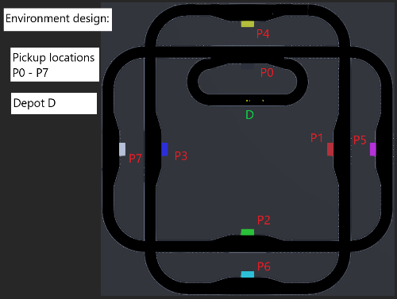

# Cab Service 3
**Group members**: *Henrik Claßen*, *Justus Flerlage*, *Felix Heimann*, *Luyanda Mlangeni*, *Gerda Zsejke Móré*, *Yue Wang*

## Project overview
Cities like Copenhagen in Denmark show how modern transportation will look like.
Here computers control the metro fully automated without any human driving interaction.
We want to take this a step further by creating an autonomous cab-on-demand service for transporting
passengers from their predefined locations to their destinations.

### Goals
Our main goal is to have a working prototype, meeting given requirements. The project is very challenging,
so problems with algorithms are expected. Therefor, related issues are still within our goal set.

### Requirements
#### General
- Pick up passengers at predefined locations
- Transport passengers quickly to their destination
- Use available cabs efficiently
- Avoid collisions
#### Environment
- All roads should be one-way(exception: connection to the depot)
- There should be at least two passing sections
- There should be at least one depot, where you can park unused cabs
- There should be at least four pick-up locations
#### Robot
- Only use the following types of sensors: ultrasonic distance sensor, camera, light sensor
- Place at least two robots in your environment
- Each robot has room for at least two passengers
#### Control
- Use the general architecture from the overview presentation
- Coordinate your robots to achieve your mission
- Make the operation safe: robust to communication failure, ...
- Verify/validate the operation
- Optimize cab efficiency: average travel time, load, ...

### Approach
Creating an autonomous service is related to a lot of problems. Especially, things
like collision avoidance and general path following are very difficult problems, even in more simpler environments.
How have you tried to meet the above requirements? What were your ideas?

- Approach 1
- Approach 2
- Approach 3

## System architecture
The overall system architecture consists of three different applications. For each cab there is a single instance
of the webots controller and a single instance of the external controller. Here the webots controller is responsible
for the interaction with our simulated environment, while the external controller manages and controls the cab by using
provided data. It is like the brain of a cab, while the webots controller is more like muscles and senses. The third application
is the backend, which controls passenger requests and the cab provisioning and distribution by communicating with
the external controller. 


### Software design
#### General
The communication between the webots controller and the external controller, and the external controller and the backend
is done by using the Transmission Control Protocol (TCP), as it is reliable and still fast enough for our purposes. For this,
we introduced a binary protocol on top of TCP for exchanging data between all parties.

#### Webots Controller
The webots controller is written in C++17, utilizing the webots API for the interaction with the webots environment, and Boost
for asynchronous networking. A single class is implemented, which consists of all functionality for the data exchange and
the command execution.

#### External Controller
Since the external controller is the most important application, as it controls and manages a cab, it is developed with ADA.
This makes it easier to verify program code and to proof its correctness. In overall, the external controller makes use of
three different modules, each running in its own thread. Two of those manage the communication with the backend and the webots
controller. The third one does calculations.

#### Backend
While running, the external controller communicates with the backend, since it sends important data for the cab movement.
The backend is written in C++17 as well, using the Boost library for asynchronous networking, graph abstraction and
command line parsing. The backend retrieves any passenger requests and distributes those onto the cabs.


### Robot design
What does your robot look like, and what functionality does it contain. 
But most of all: **Why** did you choose this design?


### Environment design
What does the environment look like in which your robot operates? 
The same: **Why** did you choose this environment?



### Algorithms
Write an introduction to the **most essential** algorithms or technologies in general that you have chosen for your project. 

Maybe with **short** code examples.

```python
def our_algorithm(x, y):
    # Do fancy stuff here
    return {'x': x, 'y': y}
```

## Summary
Although all subsystems work quite well, the integration of the overall system is still lacking. This is mainly due to
wrong time management. The project topic itself is very interesting, but even in simple environments very complicated, since
it introduces topics like collision avoidance and path following. We think that a little bit more time for the project would have
resolved the integration issue.

### Lessions learned
We did not reach our overall goal, but everyone in our group did a good job and gave its best. For the future, we can tell,
that time management, management in general and communication are the very most important things for a project.

### Future work
What problems would you tackle if you would continue to work on the project? Are there things you might actually take up and work on in the future? This part is **optional**.
